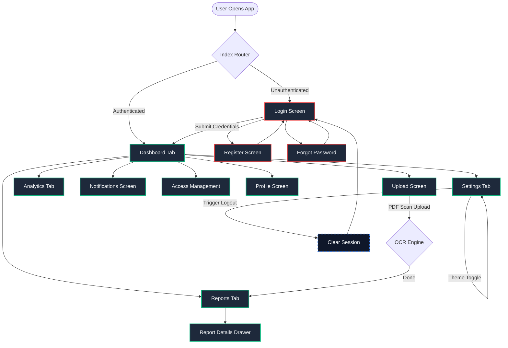

# Live GitHub Pages E2E Test Summary

## Test Metrics

- **Total Tests Executed:** 23
- **Passed:** 23
- **Failed:** 0
- **Pass Rate:** 100.00%

## Baseline/Load Testing Metrics

- **Requests per Second (RPS):** 144.11 req/sec
- **Average Response Time:** 614.25 ms
- **Min Response Time:** 218.55 ms
- **Max Response Time:** 1301.03 ms
- **Total Requests Sent:** 861
- **Successful Requests:** 851
- **Failed Requests:** 10

## Execution Status

All test cases completed successfully! ✅

## Application Route Map & Navigation Flow 🗺️

Below is the screen-to-screen navigation layout of ScanTrace, rendered via Mermaid:

### Route Matrix & E2E Coverage Map 📊

| Route Path | Screen Name | Authentication | Description | E2E Coverage |
| :--- | :--- | :---: | :--- | :---: |
| `/` | `IndexScreen` | Guest / Auth | Entry evaluation and re-routing. | Test 1 & Test 5 |
| `/(auth)/login` | `LoginScreen` | Guest | Input credentials and sign in. | Test 2 & Test 14 |
| `/(auth)/register` | `RegisterScreen` | Guest | Create new account details. | Test 3 |
| `/(auth)/forgot-password` | `ForgotPasswordScreen` | Guest | Request email password reset. | Test 4 |
| `/(tabs)/dashboard` | `DashboardScreen` | Authenticated | Health scores and trends. | Test 6 |
| `/(tabs)/reports` | `ReportsScreen` | Authenticated | View report listings. | Test 7 |
| `/(tabs)/upload` | `UploadScreen` | Authenticated | Drag and drop medical uploads. | Test 8 |
| `/(tabs)/analytics` | `AnalyticsScreen` | Authenticated | Biomarker comparisons. | Test 9 |
| `/notifications` | `NotificationsScreen` | Authenticated | View system updates. | Test 10 |
| `/access` | `AccessScreen` | Authenticated | Permissions management. | Test 11 |
| `/profile` | `ProfileScreen` | Authenticated | Edit user metadata. | Test 12 |
| `/settings` | `SettingsScreen` | Authenticated | Toggle dynamic dark theme. | Test 13 |
