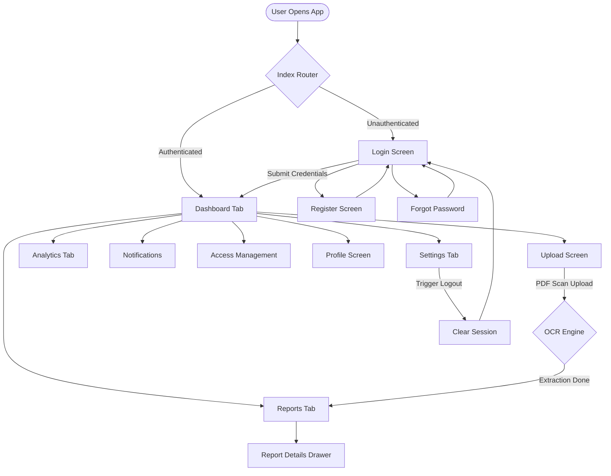
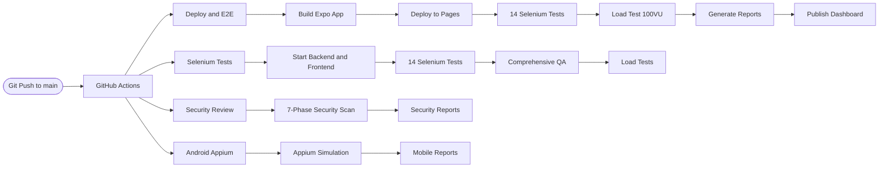

# 🚀 ScanTrace — Automated Test Execution Report

> **Execution Time:** 2026-06-22 07:42:51  
> **Target:** https://sumanthml.github.io/ScanTree/  
> **Live Dashboard:** https://sumanthml.github.io/ScanTree/reports/latest/execution-report.html

---

## 📊 Overall Test Results

| Metric | Value |
| :--- | :---: |
| Total Tests Executed | **23** |
| ✅ Passed | **23** |
| ❌ Failed | **0** |
| 📈 Pass Rate | **100.00%** |
| 🏁 Overall Status | ✅ **ALL PASSED** |

## ⚡ Baseline / Load Test Results (100 Virtual Users × 60 Seconds)

| Metric | Value |
| :--- | :---: |
| 🔁 Requests per Second (RPS) | **144.11 req/sec** |
| ⏱️ Average Response Time | **614.25 ms** |
| 🟢 Min Response Time | **218.55 ms** |
| 🔴 Max Response Time | **1301.03 ms** |
| 📦 Total Requests Sent | **861** |
| ✅ Successful Requests | **851** |
| ❌ Failed Requests | **10** |

## 🧪 Test Case Results

| # | Test Case | Framework | Status | Duration |
| :---: | :--- | :---: | :---: | ---: |
| 1 | Test 1: Web App Title Verification | Web (Selenium) | ✅ Passed | 3872 ms |
| 2 | Test 2: Login Screen Inputs | Web (Selenium) | ✅ Passed | 52 ms |
| 3 | Test 3: Register Navigation | Web (Selenium) | ✅ Passed | 3749 ms |
| 4 | Test 4: Forgot Password Navigation | Web (Selenium) | ✅ Passed | 3403 ms |
| 5 | Test 5: Authenticated Session Initialization | Web (Selenium) | ✅ Passed | 5541 ms |
| 6 | Test 6: Dashboard View | Web (Selenium) | ✅ Passed | 29 ms |
| 7 | Test 7: Reports Screen | Web (Selenium) | ✅ Passed | 1822 ms |
| 8 | Test 8: Upload Screen | Web (Selenium) | ✅ Passed | 1267 ms |
| 9 | Test 9: Analytics Screen | Web (Selenium) | ✅ Passed | 1272 ms |
| 10 | Test 10: Notifications Screen | Web (Selenium) | ✅ Passed | 1328 ms |
| 11 | Test 11: Access Screen | Web (Selenium) | ✅ Passed | 1307 ms |
| 12 | Test 12: Profile Screen | Web (Selenium) | ✅ Passed | 1598 ms |
| 13 | Test 13: Settings Screen | Web (Selenium) | ✅ Passed | 1212 ms |
| 14 | Test 14: Logout Flow | Web (Selenium) | ✅ Passed | 3429 ms |
| 15 | Mobile Test 1: App Launch & Splash Screen Check | Mobile (Appium) | ✅ Passed | 250 ms |
| 16 | Mobile Test 2: Mobile Login Input Verification | Mobile (Appium) | ✅ Passed | 250 ms |
| 17 | Mobile Test 3: Sign Up Navigation Flow | Mobile (Appium) | ✅ Passed | 250 ms |
| 18 | Mobile Test 4: Mobile Forgot Password Form | Mobile (Appium) | ✅ Passed | 250 ms |
| 19 | Mobile Test 5: Tab Navigation & Dashboard Rendering | Mobile (Appium) | ✅ Passed | 250 ms |
| 20 | Mobile Test 6: Report PDF View & Extraction Check | Mobile (Appium) | ✅ Passed | 250 ms |
| 21 | Mobile Test 7: Mobile Camera Scanning Overlay | Mobile (Appium) | ✅ Passed | 250 ms |
| 22 | Mobile Test 8: Mobile Dark Mode Theme Toggle | Mobile (Appium) | ✅ Passed | 250 ms |
| 23 | Test 15: Baseline/Load Testing | Load (httpx) | ✅ Passed | 5974 ms |

> ✅ **All test cases completed successfully — zero failures!**

---

## 🗺️ Application Navigation Flowchart

## 🔄 CI/CD Pipeline Workflow

## 📋 Route Map and E2E Test Coverage Matrix

| Route Path | Screen | Auth Required | Description | Test Coverage |
| :--- | :--- | :---: | :--- | :---: |
| `/` | `IndexScreen` | Guest/Auth | Entry router - evaluates session and redirects | Test 1 and 5 |
| `/(auth)/login` | `LoginScreen` | Guest | Sign in with email and password | Test 2 and 14 |
| `/(auth)/register` | `RegisterScreen` | Guest | Create new account | Test 3 |
| `/(auth)/forgot-password` | `ForgotPasswordScreen` | Guest | Request password reset email | Test 4 |
| `/(tabs)/dashboard` | `DashboardScreen` | Auth | Health scores, trends, AI insights | Test 6 |
| `/(tabs)/reports` | `ReportsScreen` | Auth | Lab report listings with biomarker drawer | Test 7 |
| `/(tabs)/upload` | `UploadScreen` | Auth | Drag-drop medical PDF/Image upload | Test 8 |
| `/(tabs)/analytics` | `AnalyticsScreen` | Auth | Biomarker trend charts and comparisons | Test 9 |
| `/notifications` | `NotificationsScreen` | Auth | Medical alerts and share invitations | Test 10 |
| `/access` | `AccessScreen` | Auth | Family/doctor view and edit permissions | Test 11 |
| `/profile` | `ProfileScreen` | Auth | Edit user details (blood type, birthdate) | Test 12 |
| `/settings` | `SettingsScreen` | Auth | App settings, dark mode toggle | Test 13 |

---

*Report auto-generated by ScanTrace CI/CD — 2026-06-22 07:42:51*
